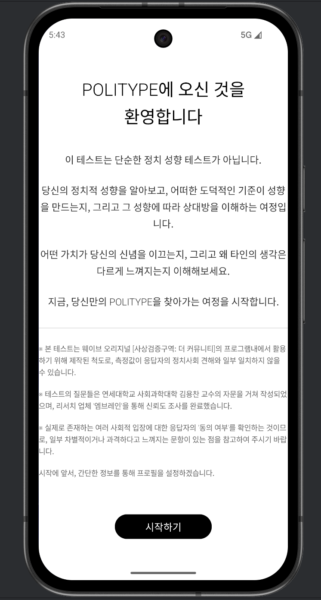
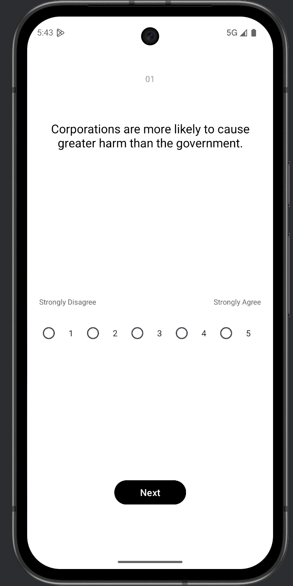
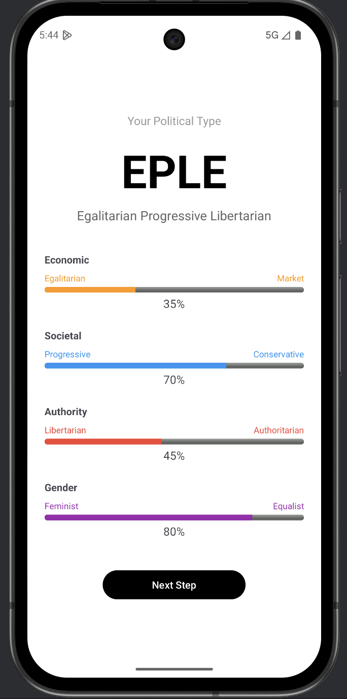

# PoliType Android

> Decode your politics through the lens of moral values.

PoliType is an Android app that classifies your political orientation into one of **16 types** across four axes — Economic, Societal, Authority, and Gender — through a 48-question survey grounded in Moral Foundation Theory.

---

## Problem Definition

Existing political typology tools (e.g., the Political Compass) reduce complex political identities to a single 2D left–right axis, which fails to capture the full picture. In Korean society specifically, political discourse is often dominated by binary framing — progressive vs. conservative — without distinguishing between economic views, social attitudes, stance on authority, and gender ideology, which can all diverge independently.

**PoliType addresses this by:**
- Separating political orientation into **four independent axes** rather than collapsing them into one
- Using **48 questions** grounded in real Korean societal debates (economic policy, minority rights, gender, authority)
- Grounding the result in **Moral Foundation Theory** (Graham, Haidt & Nosek, 2009), which explains *why* people hold certain political views — not just what those views are
- Producing a **16-type classification** (like a political MBTI) that is specific enough to be meaningful but interpretable enough to be actionable

---

## Screenshots

| Guide | Question | Result |
|-------|----------|--------|
|  |  |  |

---

## How It Works

Users answer 48 statements on a 5-point scale (Strongly Disagree → Strongly Agree). Responses are scored across four independent axes, each producing a percentage that maps to one letter:

| Axis | Liberal / Progressive | Conservative |
|------|----------------------|--------------|
| **Economic** | `E` — favors regulation, redistribution | `R` — favors free market |
| **Societal** | `P` — progressive on social issues | `C` — traditional / conservative |
| **Authority** | `L` — libertarian, anti-authoritarian | `A` — authoritarian, order-first |
| **Gender** | `F` — feminist / egalitarian | `E` — traditional gender roles |

The result is a 4-letter type code such as **EPLA** or **RCAE** — 16 types in total.

### Moral Foundation Comparison

Results are also compared against research baselines from:

> Graham, J., Haidt, J., & Nosek, B. A. (2009). *Liberals and conservatives rely on different sets of moral foundations.* Journal of Personality and Social Psychology, 96(5), 1029–1046.

The app maps your type to one of seven political categories (Very Liberal → Very Conservative) and shows how your moral foundation scores compare to the typical profile for that category across six dimensions: Care, Equality, Proportionality, Loyalty, Authority, and Purity.

---

## App Flow

```
MainActivity  →  GuideActivity  →  ProfileActivity  →  QuestionActivity  →  ResultActivity
  (Start)          (Guide)           (Profile input)     (48 questions)        (Type + scores)
```

---

## Tech Stack

- **Language**: Java
- **Min SDK**: 24 (Android 7.0)
- **Target SDK**: 36
- **Libraries**: AndroidX AppCompat, Material Design, ConstraintLayout

---

## Project Structure

```
app/src/main/
├── java/com/example/politype_android/
│   ├── MainActivity.java          # Entry point
│   ├── GuideActivity.java         # Survey instructions
│   ├── ProfileActivity.java       # User profile input
│   ├── QuestionActivity.java      # Question flow & scoring
│   ├── ResultActivity.java        # Result display
│   ├── model/
│   │   ├── Question.java          # 48-question bank
│   │   ├── PoliType.java          # Axis scoring & type calculation
│   │   └── User.java              # User data model
│   └── moral/
│       └── MoralFoundationBaselineSystem.java  # Research-based comparison
└── res/
    └── layout/                    # XML layouts for each screen
```

---

## Getting Started

1. Clone the repo:
   ```bash
   git clone https://github.com/hwnprc/politype-android.git
   ```
2. Open in **Android Studio**.
3. Sync Gradle and run on an emulator or physical device (Android 7.0+).

> `local.properties` is excluded from version control — Android Studio will generate it automatically based on your local SDK path.

---

## Note on Questions

The survey covers economic policy, social issues, authority and governance, and gender — with several questions referencing Korean societal contexts. The app is designed with Korean audiences in mind.
